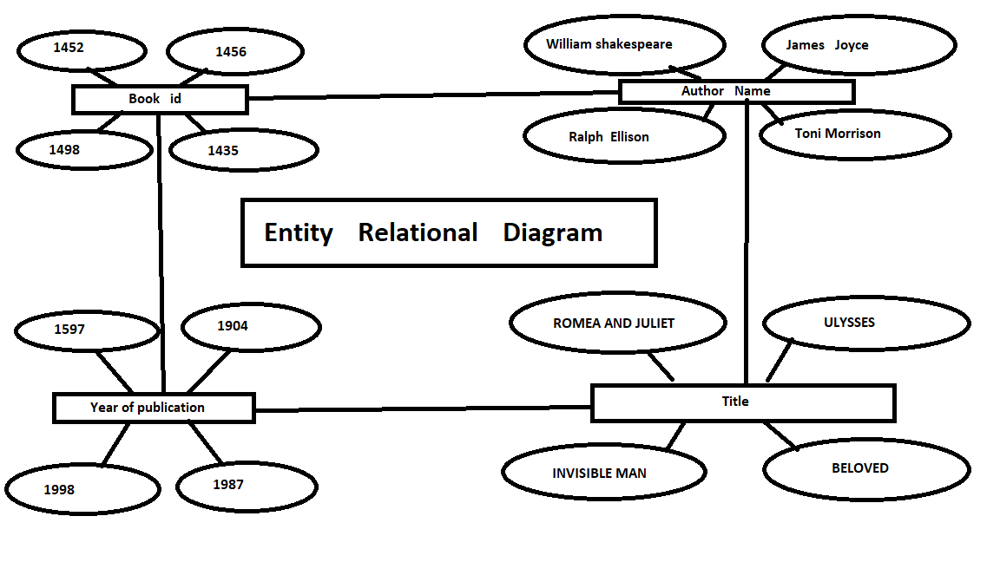
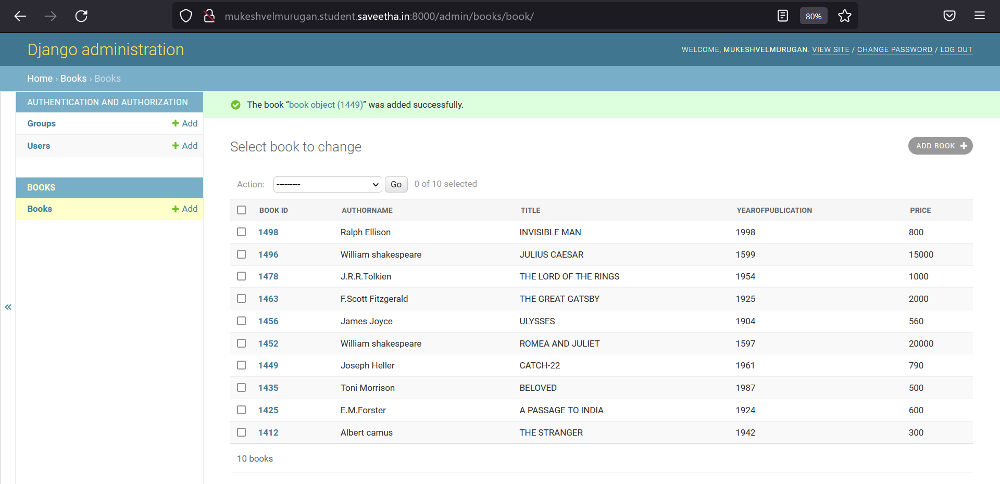

# Django ORM Web Application

## AIM:
To develop a Django application to store and retrieve data from a database using Object Relational Mapping(ORM).

## Entity Relationship Diagram:


## DESIGN STEPS:

### STEP 1:
creating a table using meanings full details in ORM

### STEP 2:
upload the python code

### STEP 3:

push the code to github

## PROGRAM:
``` 
admin.py:

from django.contrib import admin
from .models import book,bookAdmin

admin.site.register(book,bookAdmin)

models.py

from django.db import models
from django.contrib import admin
# Create your models here.
class book(models.Model):
    book_id=models.CharField(primary_key=True,max_length=4,help_text='bookid')
    Authorname=models.CharField(max_length=50)
    Title=models.CharField(max_length=100)
    YearOfPublication=models.IntegerField()
    Price=models.IntegerField()
    

class bookAdmin(admin.ModelAdmin):
    list_display=('book_id','Authorname','Title','YearOfPublication','Price',)

```
## OUTPUT:




## RESULT:
The code is executed successfully.

